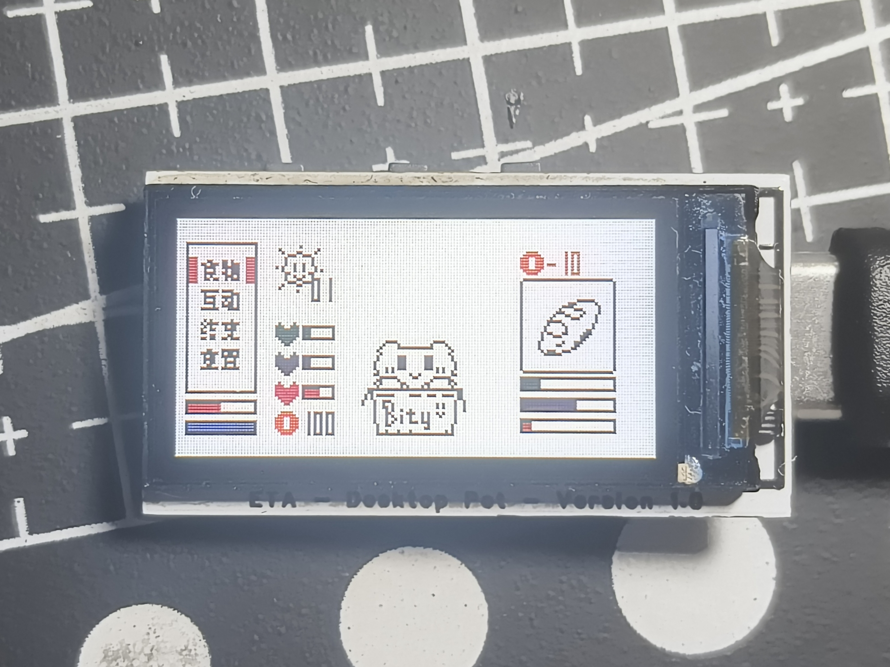
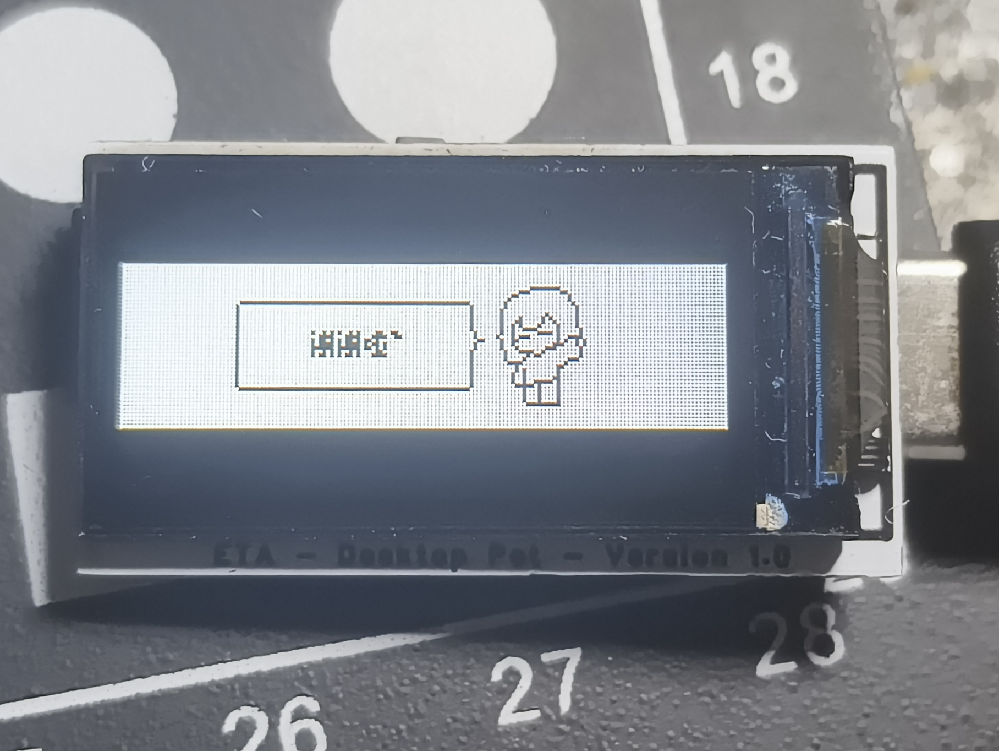
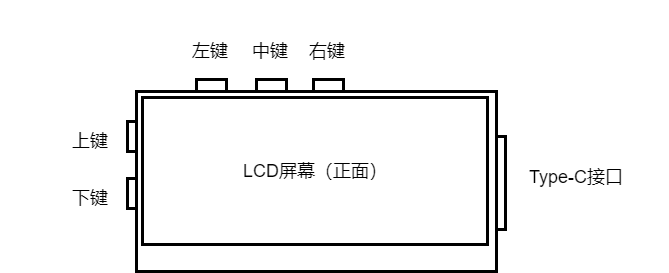
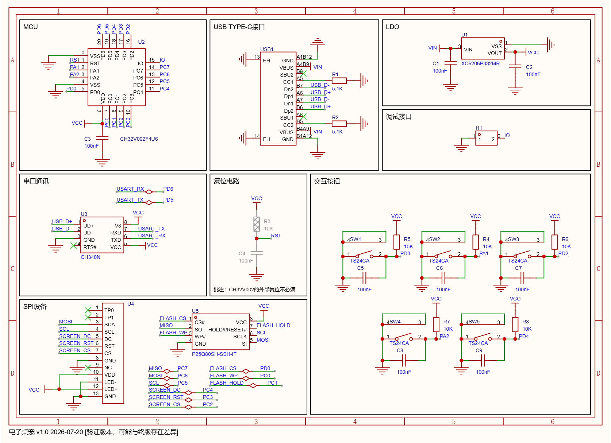

# Bity-CH32V006-Desktop-Pet
基于CH32V006平台的电子桌宠

## 项目简介

桌宠Bity项目是由西南交通大学电子科技协会立项并支持，由西南交通大学电子科技协会实验室协作完成的趣味性项目。该项目复现简单，成本低。桌宠项目硬件本身提供了较大冗余，项目参与者可轻松开发固件，拓宽其功能。
该项目以屏幕与按键交互为主，具有存储和数据传输（硬件具备，软件暂无）等功能。

## 项目成员
- 硬件设计：MAGKK
- 固件开发与维护：MAGKK
- 素材绘制：MAGKK

## 实物展示
实物图

部分动画预览

## 项目编译与下载

- 该项目可使用MounRiver Studio Ⅱ编译
- 该项目建议使用WCH-LinkE下载

## 硬件构成

- CH32V006F8U6 RISC-V MCU作为主控
- 标准0.96寸160*80 LCD TFT 屏幕
- 5个可交互按键
- Type-C供电与数据传输接口
- CH340N串口通讯芯片（当前程序版本暂未使用，可保留）

## 交互

## 电路设计

- 请注意！原理图中的MCU标注为CH32V002，实际焊接中请使用CH32V006。如果您需要单独开发固件，并且CH32V002的硬件满足需求，CH32V002可以在本电路上正常工作。但是受到CH32V002 RAM与ROM的限制，建议采用CH32V006进行开发。

## PCB生产

- 本项目硬件部分使用立创EDA设计
- 本项目PCB由嘉立创制造
- 制板文件详见[Gerber文件](./Hardware/Gerber_PCB_DesktopPet_ReleaseVersion.zip)

## PCB焊接
- 本项目使用立创EDA提供的离线焊接辅助工具辅助焊接。
- [焊接辅助工具](./Hardware/[焊接辅助工具]PCB_DesktopPet.zip)

## 关于项目复刻与开发

如果您想复刻或开发本项目，第一次创建工程可以根据以下步骤：
1. 进入南京沁恒微电子官网[wch.cn](https://wch.cn/)，找到MounRiver Studio Ⅱ下载入口，根据系统类型安装对应版本；
2. 建立CH32V006空工程；
3. 将本项目User文件夹内的程序复制到新建立工程的同名目录下（main.c需要覆盖，其余存在文件需保留）；
4. 打开User文件夹下的system_ch32v00X.c，将“#define SYSCLK_FREQ_48MHZ_HSI”取消注释，并注释其他项；
5. 编译并下载。

## 任务列表

- [x] 基本动画
- [x] 基本交互逻辑
- [x] 存储与读取
- [ ] 固件代码优化与整理
- [ ] 数据交换与配套上位机软件
- [ ] 更加流畅的动画（肝不完了！！QAQ）

## 硬件问题

- 当前版本硬件（PCB）缺少LCD背光LED的限流电阻。此问题并不致命，但如果您需要重新设计PCB，建议加入该限流电阻。该操作可以减少因电流过大导致的LDO发热现象。

## 其他

- 这是本人第一次开源项目，如有疏漏欢迎指正！
- 欢迎各位加入我们的QQ群参与讨论！群号：1062625757
- 部分LCD驱动代码是从两年前就开始着手编写，时间跨度比较长，故保留的部分本项目没有使用到的函数还请自行辨别优化。

## 开源协议

- 本人编写的全部固件代码采用 MIT 协议开源，详情见 [LICENSE](./LICENSE) 文件。
